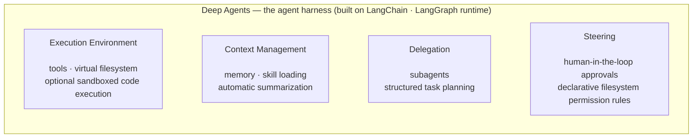
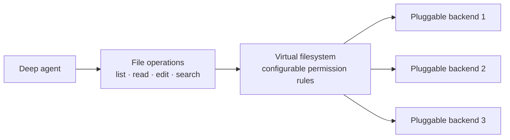
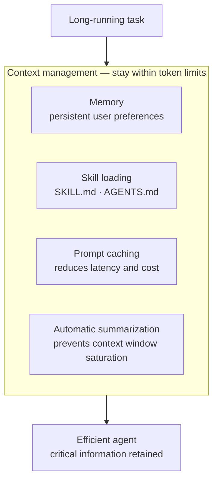
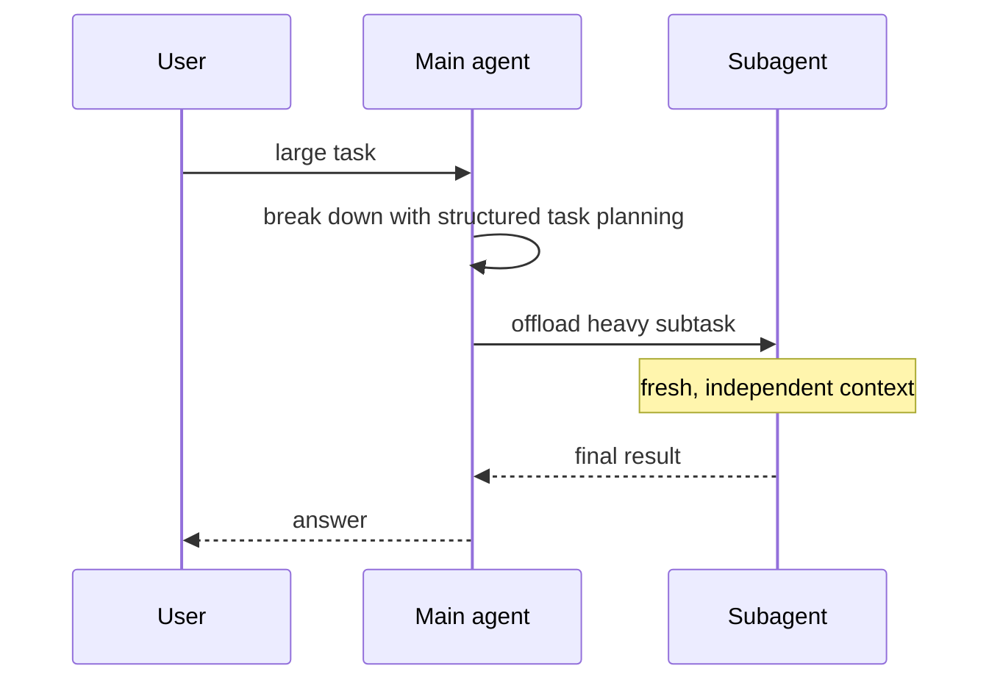
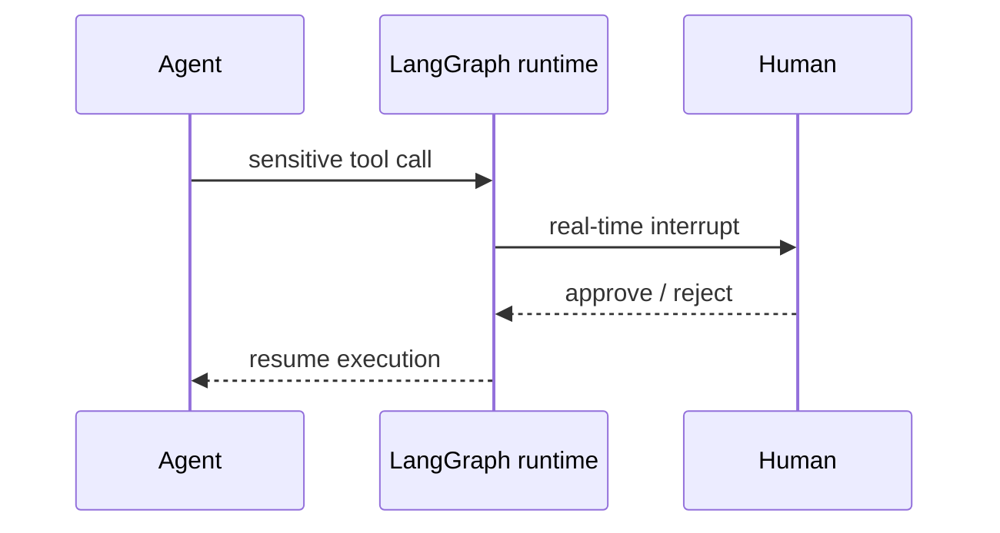

# Deep Agents 101

## Episode 01 — Your First Deep Agent

*An accessible framework for LLM-powered agents with built-in support for complex, multi-step work*

---

# What is Deep Agents?

- An **accessible framework** for building LLM-powered agents
- Built on **LangChain**, running on the **LangGraph runtime**
- An **"agent harness"** — a reliable environment for:
  - Long-term memory
  - File system management
  - Delegation

---

# Core Architecture — Four Pillars

---

# Pillar 1 — Execution Environment

- Provides the **tools** the agent works with
- A **virtual file system** for data
- **Optional sandboxed code execution**
- Goal: agents interact **safely** with data and external systems

---

# Pillar 2 — Context Management

- **Memory**
- **Skill loading**
- **Automatic summarization**
- Keeps agents **efficient within token limits** while retaining critical information

---

# Pillar 3 — Delegation

- Breaks down **large tasks**
- Spawns **subagents**
- Uses **structured task planning tools**
- Better **accountability**

---

# Pillar 4 — Steering

- **Human oversight** built in
- **Human-in-the-loop approvals** for sensitive tool calls
- **Declarative filesystem permission rules**

---

# Key Capabilities

1. **Virtual Filesystem** — pluggable backends, configurable permission rules
2. **Skill & Memory Integration** — `SKILL.md` / `AGENTS.md` injected into context
3. **Advanced Context Optimization** — prompt caching + summarization
4. **Task Delegation** — isolated subagents with fresh contexts
5. **Human-in-the-loop** — real-time interrupts via LangGraph

---

# Virtual Filesystem

- **Pluggable backends** for managing files
- Operations: **listing, reading, editing, searching**
- **Configurable permission rules**

---

# Skill & Memory Integration

- Standardized files: **`SKILL.md`** and **`AGENTS.md`**
- **Dynamically injects** domain knowledge into the agent's context
- Carries **persistent user preferences**

---

# Advanced Context Optimization

- **Prompt caching** → reduces **latency and costs**
- **Summarization** → prevents **context window saturation** during long-running tasks

---

# Task Delegation

- Main agent **offloads heavy subtasks** to isolated subagents
- Subagents operate in **fresh, independent contexts**
- They **return final results** upon completion

---

# Human-in-the-Loop

- Integrates with **LangGraph**
- **Real-time interrupts**
- Developers keep control over **critical decision-making points**

---

# In Summary

Deep Agents lets you build agents that:

- Perform **complex, multi-step tasks**
- Handle **persistent memory**
- Enforce **strict file access controls**
- **Decompose massive projects** into manageable subtasks

A **highly customizable and scalable** solution for modern AI applications.
