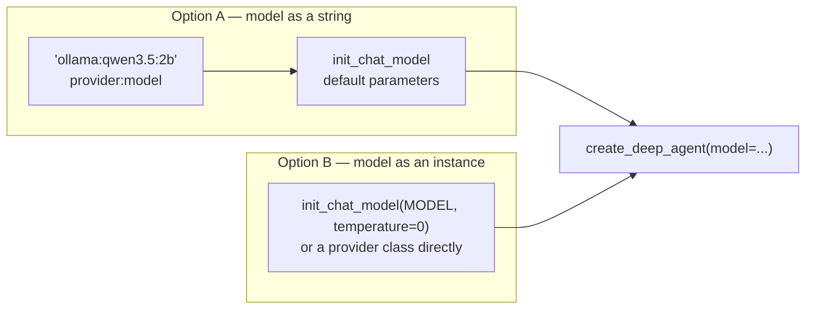
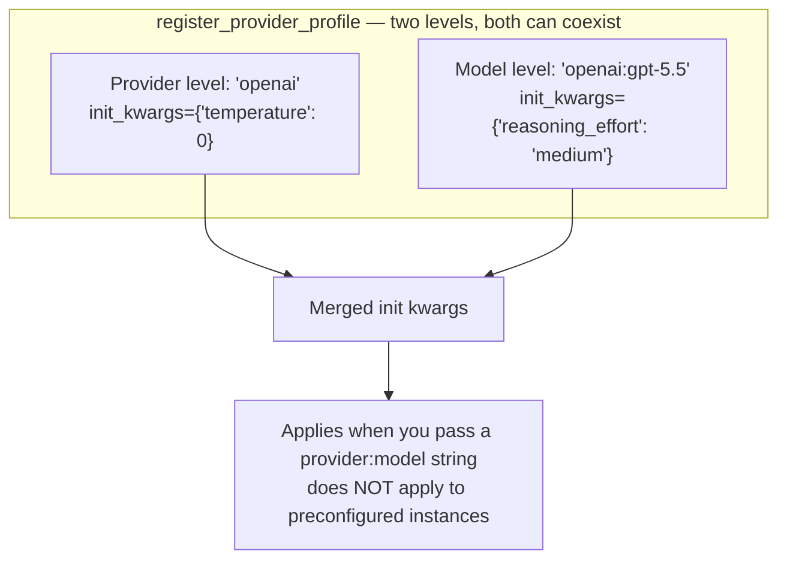
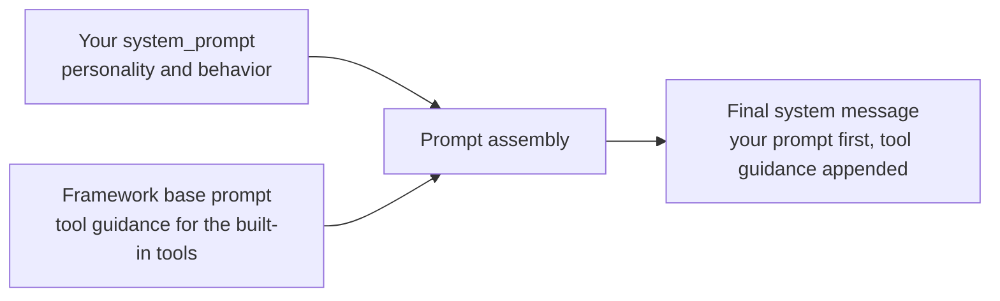
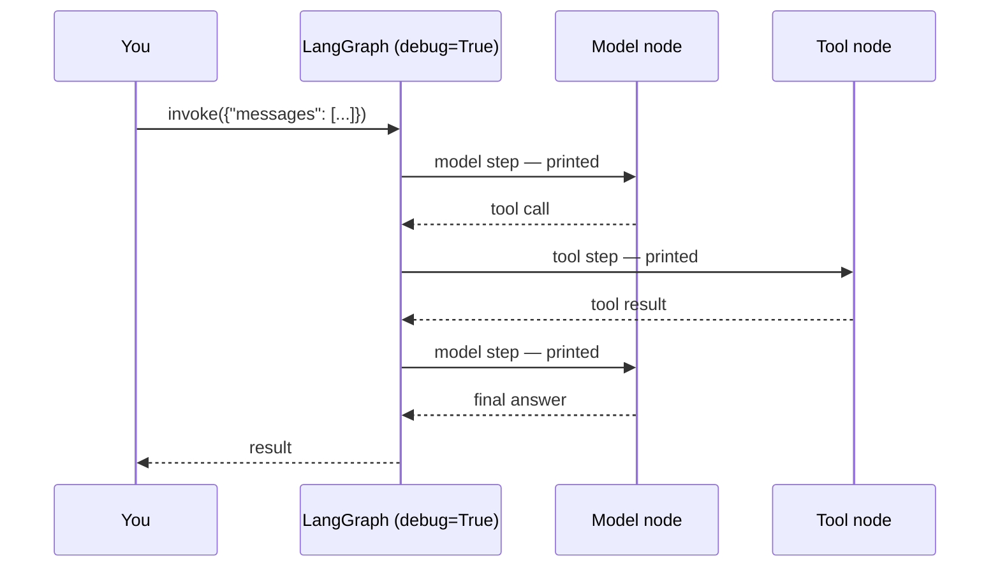

# Deep Agents 101

## Episode 02 — Models and System Prompts

*Two ways to give the agent a brain — and where your system prompt actually lands*

---

# Two Ways to Specify a Model

- **A string**: `"provider:model"` — the simplest option
- **An instance**: build the model yourself for full control

Deep Agents work with **any LangChain chat model that supports tool calling**.



---

# Option A — Model as a String

```python
agent = create_deep_agent(model="ollama:qwen3.5:2b")
```

- Pass a `provider:model` string to `create_deep_agent`
- Under the hood, the string is resolved via **`init_chat_model`** with **default parameters**
- Any LangChain provider works: `ollama:`, `openai:`, `anthropic:`, `google_genai:`, …
- Tip: use `provider:model` to **quickly switch between models**

---

# How the String Is Parsed

`"baseten:zai-org/GLM-5.2"`

- The **provider prefix** selects the LangChain integration
- Everything **after the colon** is passed through as the model identifier
- Identifiers vary by provider:
  - Simple names: `gpt-5.5`
  - Namespaced IDs / deployment paths: `zai-org/GLM-5.2`

---

# Option B — Model as an Instance

```python
from langchain.chat_models import init_chat_model

model = init_chat_model(MODEL, temperature=0)
agent = create_deep_agent(model=model)
```

- Build the model yourself when you need to **tune parameters**
- `temperature`, `max_tokens`, timeouts, `base_url`, …
- **Available parameters vary by provider**
- deepagents uses the instance **as-is**

---

# Which One to Pick?

| | String | Instance |
| --- | --- | --- |
| Effort | One argument | A few lines |
| Parameters | Provider defaults | Full control |
| Switching models | Change the string | Rebuild the model |
| Use when | Prototyping, quick swaps | Tuning behavior, custom endpoints |

---

# Suggested Models

Tested on the **Deep Agents eval suite** (basic agent operations):

| Provider | Models |
| --- | --- |
| Google | `gemini-3.1-pro-preview`, `gemini-3.6-flash` |
| OpenAI | `gpt-5.5`, `gpt-5.4` |
| Anthropic | `claude-opus-4-8`, `claude-opus-4-7`, `claude-opus-4-6` |
| Open-weight | `GLM-5.2`, `Kimi-K2.7 Code`, `MiniMax-M3` |

*Passing the evals is necessary but not sufficient for long, complex tasks.*

---

# Provider Profiles

A `ProviderProfile` packages init parameters for `provider:model` strings:



---

# The System Prompt

```python
agent = create_deep_agent(
    model=MODEL,
    system_prompt="You are a pirate. Answer briefly.",
)
```

- `system_prompt=` gives the agent **your own instructions**
- It steers **personality and behavior**
- **Tool knowledge comes from the framework** — you don't re-teach it the tools

---

# Where Your Prompt Lands

Your `system_prompt` does **not** replace the deep-agent instructions.



- Your prompt is placed **FIRST**
- The framework's tool guidance is **appended after it**
- The agent is still a full deep agent — just a pirate one

---

# Beyond Strings: SystemMessage

- The main agent also accepts a **`SystemMessage`** with structured **content blocks**
- Deep Agents **preserve those blocks**
- Subagent dictionary specs remain **strings**

---

# `debug=True`

```python
agent = create_deep_agent(model=MODEL, debug=True)
```



- Prints **every graph step** as it executes
- Verbose by design — use it while developing
- **Keep the question tiny**

---

# Resilience

- Chat models **automatically retry** transient API failures
- Retries use **exponential backoff**
- Tune `max_retries` / `timeout` when you need to

---

# In Summary

- **String** = simplest; **instance** = full control — deepagents uses the instance as-is
- Your `system_prompt` is placed **first**; framework tool guidance is **appended after**
- The system prompt steers **personality and behavior**; tool knowledge comes from the framework
- `debug=True` is a LangGraph trace — verbose by design

**Next (ep. 03):** the agent only has built-in tools — add your own. A tool is just a Python function with a docstring.
